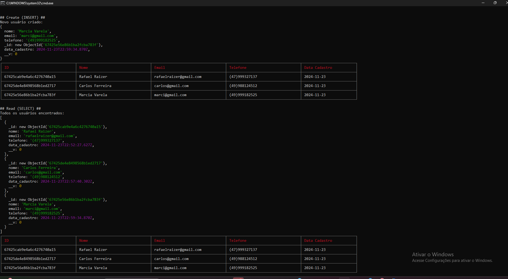
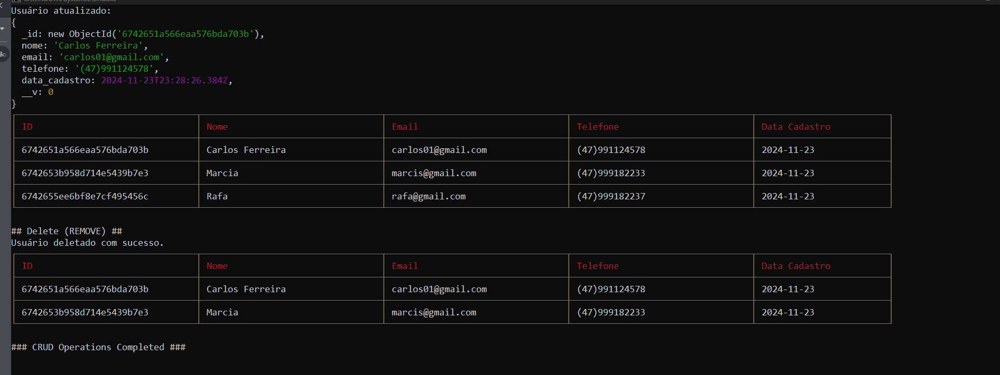

# Tarefa - Gerenciamento Banco de Dados

## Índice

- [Objetivo](#-objetivo)
- [Documentação](#-documentação-do-projeto)
- [Instalação](#instalação-com-bash)
- [Demonstração Código Resumido](#demonstração-código-resumido)
  - [- `models/usuarioModels.js`](#--modelsusuariomodeljs)
  - [- `database/index.js`](#--databaseindexjs)
  - [- `app.js`](#--appjs)

## 🌟 Objetivo:

Criar uma tabela fictícia e depois faça uma query para cada item de um CRUD - Criar uma linha, selecionar(ler), editá-la e apaga-la.

## 📖 Documentação do Projeto

 <div align="center">


[✨ **Clique aqui para saber mais da documentação** ✨](https://github.com/RaizerTechDev/tarefasStackX-itemCrud/blob/master/Documentation.md)

<br>

<div align="center">
  
 [Demonstração-Tabelas] 





<br>

---

<div align="left">

## Instalação com bash

- Clone o repositório:

```
git clone https://github.com/seu-usuario/nome-do-repositorio.git
```

- Navegue até o diretório do projeto:

```
cd nome-do-repositorio
```

- Instale as dependências:

```
npm install dotenv mongoose cli-table
```

- Instalando pacotes para formatação

```
npm install --save-dev eslint eslint-config-prettier eslint-plugin-prettier prettier
```

<br>

- Inicie o servidor:

```
npm start
```

<br>

- Vai iniciar no terminal a consulta das Tabelas.

---

## Demonstração Código Resumido

#### - `models/usuarioModel.js`

```javascript
const mongoose = require("mongoose");

const usuarioSchema = new mongoose.Schema({
  nome: { type: String, required: true },
  email: { type: String, required: true, unique: true },
  telefone: { type: String, required: true },
  data_cadastro: { type: Date, default: Date.now },
});

const Usuario = mongoose.model("Usuario", usuarioSchema);

module.exports = Usuario;
```

<br>

#### - `database/index.js`

```javascript
const mongoose = require("mongoose");
require("dotenv").config();

// Função para conectar ao banco de dados
const connectToDatabase = async () => {
  try {
    const dbURI = process.env.MONGO_URI; // URL de conexão no ambiente
    if (!dbURI) {
      console.error("A variável de ambiente MONGO_URI não foi definida!");
      process.exit(1);
    }

    await mongoose.connect(dbURI);
    console.log("Conectado ao MongoDB com sucesso!");
  } catch (err) {
    console.error("Error connecting to MongoDB:", err.message);
    process.exit(1); // Encerra o processo com erro
  }
};

// Exporta a função para ser usada em outros arquivos
module.exports = connectToDatabase;
```

<br>

#### - `app.js`

```javascript
const connectToDatabase = require("./src/database/index");
const Usuario = require("./src/models/usuarioModel");
const Table = require("cli-table");

// Execução das operações
await createUsuario(); // Criar
await readUsuarios(); // Ler
await updateUsuario(); // Editar
await deleteUsuario(); // Excluir

console.log("\n### CRUD Operations Completed ###\n");
process.exit(0);
```

---

## Tecnologias

 Tecnologias utilizadas no projeto:

- `JavaScript (JS)`
  "Linguagem de Programação do Navegador".
  "Scripting Dinâmico para Web".
  <br>

- `Node.js`
  "Ambiente de Execução JavaScript do Lado do Servidor".
  "Servidor Escalável em JavaScript".
  <br>

- `Documentation.md`
  "Guia detalhado para uso e manutenção do projeto."
  "Referência central para funcionalidades, práticas e requisitos."
  <br>

- `Git`
  "Sistema de controle de versões"
  <br>

- `Github`
  "Plataforma para hospedagem de código-fonte"
  <br>

- `Visual Studio Code`
  "Editor de código-fonte"
  <br>

---

## Licença

- Esse projeto está sob a licença MIT.
  <br>

---

 Autor

<p>
    
    <p>&nbsp&nbsp&nbspRafaelRaizer-Dev<br>
    &nbsp&nbsp&nbsp<a href="https://api.whatsapp.com/send/?phone=47999327137">Whatsapp</a>&nbsp;|&nbsp;<a href="https://www.linkedin.com/in/rafael-raizer//">LinkedIn</a>&nbsp;|&nbsp;<a href="https://github.com/RaizerTechDev">GitHub</a>|&nbsp;<a href="https://public.tableau.com/app/profile/rafael.raizer">Tableau</a>|&nbsp;<a href="https://raizertechdev-portfolio.netlify.app/">Portfólio</a>&nbsp;</p>
</p>
